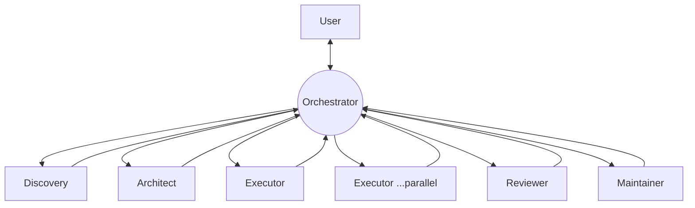

# `.kandev/` — reusable KanDev operating system

This directory is the **process foundation** for Songara PWAs, the counterpart to the
**code foundation** shipped as [`@songara/pwa-base`](../docs/guides/consuming-pwa-base.md).
It holds role prompts, ticket templates, lightweight decision records, and workflow
guides that every future PWA repository can inherit.

It is intentionally **thin**. It does not restate engineering behaviour, report shapes,
or architecture rules — it links to their sources of truth:

| Source of truth | Owns |
| --- | --- |
| [`CURSOR.md`](../CURSOR.md) | Execution philosophy, validation ladder, Developer Actions, Task lifecycle, Definition of Done |
| [`packages/completion-report/src/types.ts`](../packages/completion-report/src/types.ts) + [`completion-report-contract.ts`](../packages/completion-report/src/completion-report-contract.ts) | `RunCompletionSummary` shape + section registry (never redefine sections elsewhere) |
| [`docs/milestones/VISION.md`](../docs/milestones/VISION.md) | Living foundation intent (north star) |
| [`docs/architecture.md`](../docs/architecture.md) + [`docs/adr/`](../docs/adr/) | Package map, dependency rules, accepted decisions ([ADR-007](../docs/adr/007-pwa-base-reusable-foundation.md) = identity) |
| [ADR-003](../docs/adr/003-phase2-shared-packages.md) | **Two-consumer rule** — the gate for promoting code into PWA-Base |
| [`docs/guides/consuming-pwa-base.md`](../docs/guides/consuming-pwa-base.md) | Public API entry points (root `exports`, kits, injectable chrome) + `file:../PWA-Base` consumption |
| [`CONTRIBUTING.md`](../CONTRIBUTING.md) | Branch / PR workflow (feature → PR → squash merge); ownership |
| [`prompts/_shared.md`](./prompts/_shared.md) | Remote Git Policy + completion table (all roles) |
| [GitHub CLI on KanDev executors](#github-cli-on-kandev-executors) | Lease-first `gh` preflight + fail-fast runbook (no credential thrash) |
| [`review-checklist.md`](./review-checklist.md) | Living reviewer walkthrough |

## Environment

| Layer | Where | Role |
| --- | --- | --- |
| Dev / validation | Ubuntu VM | Day-to-day work for this repo and sibling apps |
| Production | Proxmox | Website Hosting (and any legacy Telemetry retained there) |
| Telemetry | **Not in PWA-Base** | Removed; KanDev + `packages/completion-report` replace it for engineering workflow |

Product applications are **sibling repositories**. This monorepo ships the foundation plus
the `hello-web` / `site-hello` reference app only.

## Purpose

Give every PWA project the same operating instructions from day one, so process is a
copyable asset rather than tribal knowledge. Each role knows what it produces, each
ticket has a consistent shape, and each workflow says **which role runs when**.

## Relationship to PWA-Base

PWA-Base is the canonical **upstream** for both dimensions:

- **Code** flows *up* into `@songara/pwa-base` under the ADR-003 two-consumer rule (see
  [`workflows/promote-to-pwa-base.md`](./workflows/promote-to-pwa-base.md)).
- **Process** flows *down*: sibling repos copy this `.kandev/` and treat PWA-Base's copy
  as the version to sync against.

## Contents

```text
.kandev/
├── README.md                     # this file
├── review-checklist.md           # living reviewer checklist
├── scripts/
│   └── gh-preflight.sh           #  lease/shim PASS/FAIL before gh pr create
├── prompts/                      # reusable role operating instructions
│   ├── _shared.md                #  cross-cutting rules every role inherits
│   ├── orchestrator.md           #  persistent coordinator; owns project flow & user contact
│   ├── orchestrator-dual-repo-platform.md  #  dual-repo (PWA-Base + Test-PWA) programme brief
│   ├── discovery.md              #  scope a request → discovery ticket / research report
│   ├── architect.md              #  shape the technical approach, decide shared vs app-local
│   ├── executor.md               #  implement code / docs / migrations / refactors
│   ├── reviewer.md               #  read-only review against the checklist + DoD
│   └── maintainer.md             #  cross-repo stewardship, promotion, versioning
├── templates/                    # consistent ticket shapes across projects
│   ├── discovery-ticket.md
│   ├── research-report.md        #  informational Discovery output (no implementation)
│   ├── architecture-decision.md  #  drafting shape for a formal ADR (docs/adr/)
│   ├── feature-ticket.md
│   ├── bug-ticket.md
│   └── promotion-ticket.md
├── decisions/                    # lightweight decision records (NOT formal ADRs)
│   ├── README.md
│   ├── 0000-template.md
│   └── 0001-gh-lease-preflight-fail-fast.md
└── workflows/                    # human-readable "which role, when" guides
    ├── new-feature.md
    ├── bug-fix.md
    ├── refactor.md
    └── promote-to-pwa-base.md
```

## KanDev agent profiles

When creating a task, **always set `agent_profile_id`**. Unset profiles inherit the parent
(often Discovery) and open Ask/read-only by mistake.

| Role | Profile name | Profile ID |
| --- | --- | --- |
| Orchestrator | Orchestrator | `b211f358-2094-4ee7-aab3-dc60c72d1b02` |
| Discovery | Discovery | `009eb23d-4325-41c0-9ced-f42e3a1d32de` |
| Architect | Architect | `c3f6c1b4-327a-4a7a-99ea-a881ef12c29b` |
| **Executor** | **Executor** | `dfd3c6e9-19ad-4e17-bcde-7880c71256a2` |
| Reviewer | Reviewer | `7f3772db-26a3-49be-805a-e64764e1a3c1` |
| Maintainer | Maintainer | `38393318-45c5-448a-bbe0-65bfd7db4ed6` |

The ID above is the implementation profile. Keep the KanDev profile **name** as **Executor**.

## Orchestration model

Work is coordinated by a **persistent [Orchestrator](./prompts/orchestrator.md)**. The user
talks to the Orchestrator; the Orchestrator owns project state and dispatches specialists.
Specialist roles are **disposable workers** — created for a piece of work, they do it, report
back, and go away. The Orchestrator is the hub of every hand-off:



Key properties:

- **The Orchestrator owns project flow.** It decides the next task from **project state**,
  not by walking a fixed sequence.
- **Specialists are disposable workers.** They report to the Orchestrator using the
  completion table + hand-off in [`_shared.md`](./prompts/_shared.md), then signal
  `step_complete_kandev`. **Exception:** Executors run the **human validation gate** in
  the task chat (offer primary-local sync; open PR only when the human asks) — plain
  messages, not clickable question cards.
- **Multiple Executors may run simultaneously** when the work is genuinely independent
  (non-overlapping packages/files; sequence anything sharing `pnpm-lock.yaml`).
- **Every specialist reports back to the Orchestrator**, which reviews the work against the
  original objective and presents the user-facing summary (including branch + PR URL).
- **Remote Git Policy:** feature branch → (human tests) → PR → human squash-merge. See
  [`prompts/_shared.md`](./prompts/_shared.md). No direct pushes/merges to `main`. PR is
  opened only after the human asks (Executor gate).
- **KanDev `gh` + credential lease:** see [GitHub CLI on KanDev executors](#github-cli-on-kandev-executors) — preflight → fail-fast; never thrash alternate credentials.
- **Start of every ticket:** sync to `origin/main`, then a dedicated feature branch —
  [`prompts/_shared.md`](./prompts/_shared.md). Ticket briefs must include the commands.
- **Next ticket:** only after **explicit human approval**. A merged PR alone is not
  approval to spawn the next specialist. If the next ticket depends on a merge, wait for
  confirmed merge, then start.
- **Orchestrator briefs:** every task description must follow the ticket brief structure in
  [`prompts/orchestrator.md`](./prompts/orchestrator.md) (role + profile, sync + branch,
  objective, deliverables, out of scope, validation, PR wrap-up, SoT links).
- **Orchestrator owns git governance:** one PR per logical ticket; parallel Executors do
  not share branches; never instruct merge-to-`main`.

### The roles

| Role | Prompt | Typically produces | Notes |
| --- | --- | --- | --- |
| **Orchestrator** | [`prompts/orchestrator.md`](./prompts/orchestrator.md) | task sequencing, delegation, user-facing summaries | Persistent; rarely implements (trivial docs only) |
| **Discovery** | [`prompts/discovery.md`](./prompts/discovery.md) | [discovery ticket](./templates/discovery-ticket.md) or [research report](./templates/research-report.md) | Clarifies problem & scope; writes no code |
| **Architect** | [`prompts/architect.md`](./prompts/architect.md) | [architecture decision](./templates/architecture-decision.md) draft (→ `docs/adr/`) or a [decision record](./decisions/) | Applies the two-consumer rule and dependency rules |
| **Executor** | [`prompts/executor.md`](./prompts/executor.md) | code, docs, migrations, refactors + completion summary | Build Mode per `CURSOR.md`; not just features; may run in parallel |
| **Reviewer** | [`prompts/reviewer.md`](./prompts/reviewer.md) | review findings | **Read-only**; never fix-forward |
| **Maintainer** | [`prompts/maintainer.md`](./prompts/maintainer.md) | promotions, version bumps, `.kandev/` upkeep | Cross-repo steward; owns the promotion gate |

### Typical flow

```text
User → Orchestrator → Discovery → Orchestrator → Architect → Orchestrator
     → Executor(s) → Orchestrator → Reviewer → Orchestrator
     → Maintainer (if required) → Orchestrator → User
```

The Orchestrator returns to the centre after every step and chooses what happens next.
**Architect is skippable** for small features and most bug fixes; **Maintainer** runs only
when promotion or a release is involved. The [workflow guides](./workflows/) describe typical
sequences the Orchestrator adapts to project state.

## GitHub CLI on KanDev executors

Runbook for opening PRs from a KanDev session. Policy substance stays in
[`prompts/_shared.md`](./prompts/_shared.md) (Remote Git Policy + wrap-up + hard bans).
Tactical decision: [LDR-0001](./decisions/0001-gh-lease-preflight-fail-fast.md).

### Correct first path (copy-paste)

Do this **before** drafting a PR body or running `gh pr create`:

```bash
# 1) Lease-aware gh must win over any other gh on PATH (e.g. ~/.local/bin/gh)
export PATH="${KANDEV_GITHUB_CLI_SHIM_DIR}:$PATH"

# 2) Preflight — PASS/FAIL only; prints no secrets
bash .kandev/scripts/gh-preflight.sh
# If this repo has no copy yet: bash "${SONGARA_PROJECTS_ROOT:-$HOME/projects}/PWA-Base/.kandev/scripts/gh-preflight.sh"
```

On **PASS**: draft the PR body, then `gh pr create` (still with shim first on `PATH`).
On **FAIL**: **stop immediately**. Paste the preflight output (and the single broker/`gh`
error if any) into task chat for the Orchestrator/human. Do **not** retry other credential
sources.

### What “good” looks like

| Check | Expected |
| --- | --- |
| `echo "$KANDEV_GITHUB_CLI_SHIM_DIR"` | Non-empty temp dir containing `gh` → `agentctl` |
| `KANDEV_GITHUB_CREDENTIAL_*` | Present in the session env (broker URL, lease, host, owner, repo, session, task) |
| `command -v gh` after PATH fix | Equals `$KANDEV_GITHUB_CLI_SHIM_DIR/gh` |
| Preflight | Prints `PASS:` lines and exits 0 |

Managed lease: when the session injects `KANDEV_GITHUB_CREDENTIAL_*`, use those values
only. Do **not** invent, paste, or overwrite lease env vars.

Real `gh` binary: the shim wraps a real CLI elsewhere on `PATH`. A user-local binary at
`$HOME/.local/bin/gh` is fine **only after** the shim dir — never ahead of it.

### Symptoms → check → fix / escalate

| Symptom | Check | Fix / escalate |
| --- | --- | --- |
| `gh auth status` → not logged in; `git push` (SSH) still works | `type -a gh` — first hit is `~/.local/bin/gh` or `/usr/bin/gh`, not the shim | `export PATH="$KANDEV_GITHUB_CLI_SHIM_DIR:$PATH"` and re-run preflight. Split auth is normal: SSH ≠ lease HTTPS. |
| `resolve GitHub credential: broker returned HTTP 401` | Lease/session binding; run preflight once | **Fail-fast.** Report exact error + preflight. Do not decrypt KanDev DBs or mint temp PATs. Platform/Orchestrator owns broker repair. |
| `KANDEV_GITHUB_CLI_SHIM_DIR` unset / empty | Session not lease-injected | Stop; escalate — do not fabricate shim dirs or lease vars. |
| Shim first but `gh` still fails | Single `gh api user -q .login` with shim on `PATH` | Report stdout/stderr once; escalate. No multi-minute probe loops. |
| Agent wants a PAT from KanDev secrets / `master.key` | — | **Banned.** Never. |

### Hard bans (all roles)

- Decrypting KanDev DB / `master.key` / secrets tables for GitHub tokens
- Writing temp PATs, inventing lease env vars, or pasting secrets into chat
- Multi-minute auth probe loops (alternate `PATH`s, repeated `gh auth login`, secret stores)
- Drafting a large PR body **before** preflight PASS

### Platform note (escalate, do not workaround with secrets)

If the session already sets `KANDEV_GITHUB_CLI_SHIM_DIR` but injects `PATH` with
`~/.local/bin` **before** the shim, bare `gh` silently skips the lease. Agents must
prepend the shim (above). Long-term: KanDev should put the shim directory first on
`PATH` for Executor sessions so the default `gh` is lease-aware.

## Formal ADRs vs lightweight decisions

- **Formal ADR** — architecture boundaries, dependency rules, public API changes.
  Lives in [`docs/adr/`](../docs/adr/). Draft with
  [`templates/architecture-decision.md`](./templates/architecture-decision.md).
- **Lightweight decision record (LDR)** — a quick, local, reversible call that does not
  warrant a formal ADR. Lives in [`decisions/`](./decisions/). See its
  [README](./decisions/README.md).

Rule of thumb: *if it changes a boundary in `docs/architecture.md`, it is an ADR; if it is
a tactical choice within an accepted boundary, it is an LDR.*

## How future projects consume these assets

1. Copy `.kandev/` into the new repo when scaffolding.
2. Adjust only project-specific deltas (project name, extra workflows). Keep the prompts,
   templates, and workflow guides pointing at their sources of truth.
3. Treat PWA-Base's `.kandev/` as upstream: periodically diff and pull improvements.
4. In an isolated KanDev worktree, run the sibling linker before install (per the
   `songara-sibling-file-deps` rule):

   ```bash
   node "${SONGARA_PROJECTS_ROOT:-$HOME/projects}/PWA-Base/scripts/ensure-sibling-file-deps.mjs"
   ```

## Maintaining this directory

Owned by the **Maintainer** role. When you change an asset here, keep it thin: if you find
yourself copying rules from `CURSOR.md`, the report contract, or an ADR, link instead.
