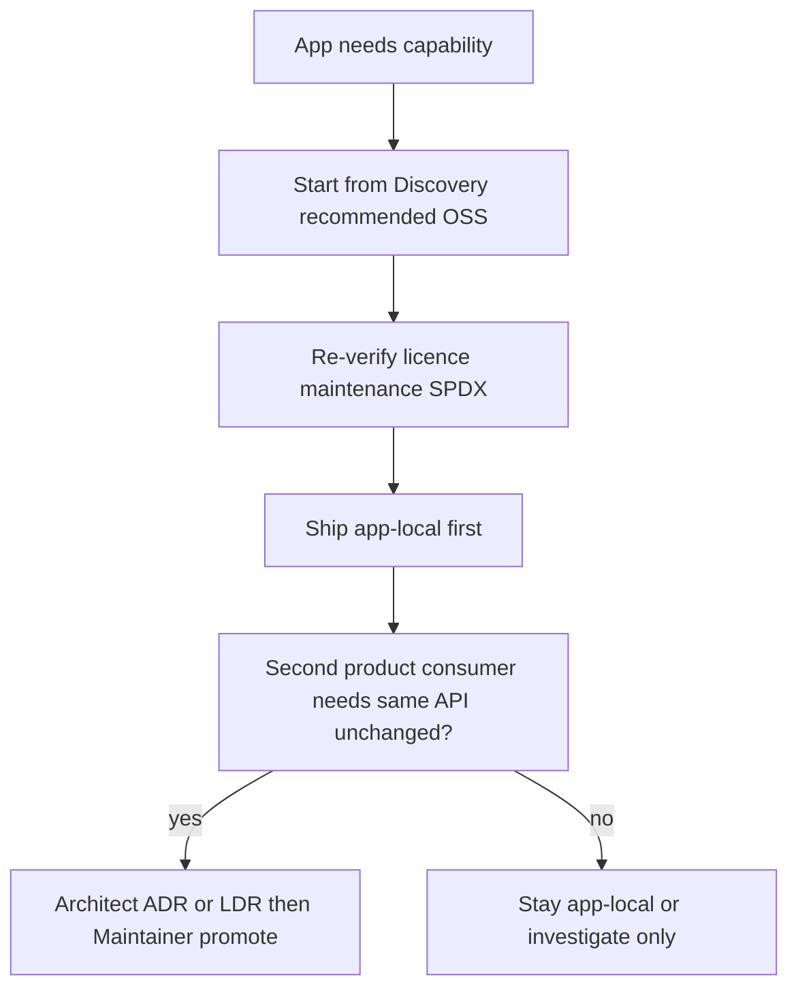

# OSS adoption plan for Songara PWA-Base

> Architect decision shape for Discovery’s OSS catalogue. **Docs only** — no wrappers
> implemented here. Promotion into `@songara/pwa-base` still requires ADR-003’s
> two-consumer gate and the [promote-to-pwa-base](https://github.com/RSHomeServer/PWA-Base/blob/main/.kandev/workflows/promote-to-pwa-base.md)
> workflow.

| | |
| --- | --- |
| **Date** | 2026-08-06 |
| **Author** | Architect (Test-PWA lane) |
| **Discovery SoT** | [`../research/oss-capability-catalogue.md`](../research/oss-capability-catalogue.md), [`../research/README.md`](../research/README.md) |
| **Foundation SoT** | [ADR-007](https://github.com/RSHomeServer/PWA-Base/blob/main/docs/adr/007-pwa-base-reusable-foundation.md), [ADR-003](https://github.com/RSHomeServer/PWA-Base/blob/main/docs/adr/003-phase2-shared-packages.md), [consuming-pwa-base](https://github.com/RSHomeServer/PWA-Base/blob/main/docs/guides/consuming-pwa-base.md), [architecture.md](https://github.com/RSHomeServer/PWA-Base/blob/main/docs/architecture.md) |
| **Consumers today** | `hello-web` (in-repo reference) · Test-PWA (smoke SoloSiteApp) |
| **Promote horizon** | **Hold** until a real second **product** consumer will use an unchanged API. Test-PWA is smoke-only and does **not** unlock speculative wraps. |

---

## 1. Problem restatement

Songara PWAs need mature browser-first OSS for media, offline data, PWA tooling, a11y,
i18n, and engineering practice — without reinventing infrastructure or bloating
`@songara/pwa-base`. Discovery produced a living catalogue with suitability labels
(**Application-local** / **Wrap in PWA-Base** / **Investigate further**).

Architect’s job is to turn that catalogue into:

1. Explicit **shared vs app-local** decisions under ADR-003 / ADR-007.
2. Named **package / export touchpoints** (or “none yet — app-local”).
3. **Executor-ready sequencing** that does not invent second consumers.

### Acceptance criteria

- [x] Plan cites Discovery files and foundation ADRs/guides (no archive SoT).
- [x] Every promote candidate records a **two-consumer check** (named consumers or **held**).
- [x] Summary table uses columns: `name | description | purpose | value | what it can be used for`.
- [x] Dependency rules respected: sibling apps import only documented `@songara/pwa-base`
  entry points; never rewrite `file:../PWA-Base`.
- [x] Non-goals stated: no catalogue host, no Telemetry product in PWA-Base, no
  single-consumer promotions.
- [x] Phased next tickets are investigate / gate work — **no promote Executor** until a
  second product consumer exists.

---

## 2. Decision principles

1. **Platform APIs first** — MediaStream, Web Audio, Web Crypto, IndexedDB, Cache, Push.
   OSS is for ergonomics, codecs, models, and cross-browser gaps.
2. **Two-consumer rule** — promote only when two **present or near-term product**
   consumers will use the API unchanged (ADR-003). Hello + Test-PWA smoke is **not**
   enough to open foundation extraction tickets.
3. **Eligibility ≠ approval** — “Wrap in PWA-Base” in the catalogue means *credible later*,
   not approved work.
4. **Vertical stacks stay app-owned** — Three.js scenes, MediaPipe pipelines, map styles,
   rich-text schemas, game engines.
5. **Prefer extending existing kits** over new packages when a wrap eventually lands
   (runtime PWA helpers, markdown, animation, browser probes, Content Packs).

### How Test-PWA fits

Test-PWA mounts via `SoloSiteApp` + `defineSite` / `SITE_CAPABILITY.offline`
([`src/App.tsx`](../../src/App.tsx), [`src/site.ts`](../../src/site.ts)). It validates the
consume path; it is **not** a second product vertical for ADR-003.

---

## 3. Already in the foundation (do not re-promote)

These catalogue clusters already have a home. Future work is **hardening or docs**, not
new speculative packages.

| Cluster | Where today | Notes |
| --- | --- | --- |
| Service worker update UX | `@songara/pwa-base` runtime (`workbox-window`, `createServiceWorkerUpdateController`, UpdateControl) | Strongest shared infrastructure already; Serwist is a migration *investigate*, not a second kit |
| Markdown render | `@songara/pwa-base/markdown` (`react-markdown`, `remark-gfm`, highlight) | Aligns with catalogue §19; consider `rehype-sanitize` when hardening — not a new package |
| Reduced-motion / motion hooks | `@songara/pwa-base/animation` | Catalogue §13 wrap hint already partially met |
| Canvas / RAF helpers | `@songara/pwa-base/render` | Low-level only; Pixi/Three stay app-local |
| Browser capability probes | `@songara/pwa-base/browser` | WebGPU probe ergonomics stay here if shared |
| Content Packs + hash verify | runtime packs (ADR-005) | Prefer packs for models/tiles over inventing asset OSS |
| Vitest in packages | per-package `vitest.config` in PWA-Base | Shared *exportable* harness still held |
| Numeric / export / UI tokens | math, export, ui, controls | Charts remain app-local per ADR-003 precedent |

---

## 4. Review by value, need, and use case

Scoring below is Architect judgment for **Songara offline-first household PWAs** (React +
Vite), not a global OSS ranking. **Action** is what Orchestrator may schedule next.

### 4.1 High value for foundation *later* (held — wrap-eligible)

| Area | Recommended OSS | Need | Value if shared | Why hold | Likely touchpoint when unblocked |
| --- | --- | --- | --- | --- | --- |
| PWA tooling presets | `vite-plugin-pwa` + Workbox; watch Serwist | Every solo PWA needs precache + update UX | Consistency across apps; less copy-paste Vite config | Runtime already covers update UX; full Vite preset needs two product apps sharing one preset | Extend `packages/runtime` + documented Vite recipe; optional `@songara/pwa-base/config` helper |
| IndexedDB ergonomics | Dexie.js (core) | Offline durable state is core to Songara PWAs | Stable store helpers / schema conventions | Only packStore-style IDB exists today; no second product schema | Thin helpers in runtime **or** documented recipe — not RxDB/Yjs in foundation |
| Headless a11y primitives | React Aria **or** Radix **or** Base UI (pick one) | Overlays/menus must be accessible | One family → token-styled overlays without hand-rolled focus traps | No shared overlay API yet; picking a family is a product decision | `@songara/pwa-base/ui` wrappers when overlays promote |
| Shared Intl helpers | FormatJS or i18next + `Intl` / Temporal polyfill | Locale formatting repeats | Small pure helpers | Message catalogs stay per app; no second catalog consumer | Small kit or `/browser` helpers — catalogs remain app-local |
| Test harness configs | Vitest + Testing Library + Playwright + axe | Engineering consistency | Faster sibling app bootstrap | Specs stay per repo; exportable config needs two adopters | `@songara/pwa-base/config` or documented templates |

**Reasoning:** These clusters are the only ones Discovery correctly flagged as wrap-eligible
*and* that match foundation identity (contracts/kits, not product verticals). Under the
locked horizon they stay **decision-ready but not scheduled for promote Executors**.

### 4.2 Investigate further (diligence before any adopt/promote)

| Topic | Why it matters | Risk if skipped | Recommended next ticket |
| --- | --- | --- | --- |
| Serwist vs Workbox | Workbox velocity risk; Serwist is active fork | Stuck on stale SW stack | Discovery: Songara Vite PWA posture |
| Dexie vs RxDB (+ Electric / PowerSync) | Sync story shapes offline apps | Accidental commercial plugin lock-in | Discovery: offline sync shortlist (core OSS only) |
| MediaPipe Tasks privacy / metrics | Vision apps may need consent | Household privacy surprise | Discovery: privacy + model hosting via Content Packs |
| Offline map tiles (PMTiles / Protomaps) | Offline maps need pack conventions | Tile licensing / hosting muddle | Investigate when a map product exists |
| WebLLM / large on-device LLMs | Privacy-preserving assistants | Bundle/memory cliffs | App-local until a product commits |
| GSAP / tldraw licences | Non-MIT redistribution | Legal block mid-feature | Diligence **only if** an app commits |

### 4.3 Stay application-local (do not pull into base)

| Category | Recommended OSS (from catalogue) | Why not foundation |
| --- | --- | --- |
| Camera / record / mic | MediaDevices, MediaRecorder, react-webcam, RecordRTC, extendable-media-recorder | Platform API + thin app glue; permission UX is product-specific |
| Speech / neural TTS | Web Speech, Transformers.js Whisper, speak-tts | Model size and UX are app-owned; offline STT hosting via packs if needed |
| ML inference | ONNX Runtime Web, Transformers.js, TF.js | Model packs + loaders may wrap *later*; engines stay app-local |
| 3D / 2D / physics / particles | Three/R3F, Pixi, Rapier, Matter, tsparticles | Scene code is product; foundation already has render/physics *helpers* |
| Charts / graphs / timelines | ECharts, Visx, Cytoscape, XYFlow, vis-timeline | ADR-003 already kept charting app-local |
| Maps | MapLibre, Turf, PMTiles | Style + tile hosting are vertical |
| Rich text / whiteboards | TipTap, Lexical, Plate, Excalidraw, tldraw | Schema lock-in; licence diligence for tldraw |
| OCR / QR / CV effects | Tesseract.js, html5-qrcode, MediaPipe pipelines | Task pipelines are product-specific |
| Forms engine | React Hook Form + Zod | Token fields may be shared; form engine stays app-local |
| Auth / crypto / payments | oidc-client-ts, jose, Payment Request | Architecture-sensitive; never invent crypto in foundation |
| Push / notifications | web-push + SW | App-local; SW patterns wrap-adjacent with runtime only when needed |
| Game engines | Phaser, PlayCanvas, Babylon | Wrong abstraction for utility PWAs |
| Observability SDKs | OpenTelemetry JS, vendor SDKs | **Application-local**; PWA-Base is **not** a Telemetry host |

**Reasoning:** Pulling these into the base would violate ADR-007 (product verticals out)
and ADR-003 (no stable shared API yet). Apps should start from the catalogue’s
**Recommended** row, re-verify SPDX, and keep code in the sibling repo.

---

## 5. Package / export touchpoints (when unblocked)

| Candidate | Action now | Future export (if promoted) | Consumers required |
| --- | --- | --- | --- |
| PWA Vite preset / SW recipe | **None — held** | Documented recipe; possibly config helper + runtime (already has update UX) | Two product PWAs sharing one preset |
| Dexie / idb helpers | **None — held** | Prefer extend `packages/runtime` storage helpers | Two apps with same store contract |
| Headless a11y wrappers | **None — held** | `@songara/pwa-base/ui` | Two apps sharing overlay API |
| Intl helpers | **None — held** | Small kit or browser helpers | Two apps sharing helper API (not catalogs) |
| Shared Vitest/axe/Playwright config | **None — held** | `@songara/pwa-base/config` templates | Two repos adopting unchanged config |
| Markdown sanitize hardening | **None — optional later LDR** | Same `@songara/pwa-base/markdown` | Existing consumers of Markdown |
| Everything in §4.3 | **App-local** | none yet — app-local | N/A |

No new public exports are proposed in this ticket. When a promotion is approved, Executor
must update `consuming-pwa-base.md` and the dependency-rules table in `architecture.md`.

**ADR stubs:** none in this PR. Boundary / public-API changes will get drafts under
`docs/architecture/adr-drafts/` (Test-PWA) or PWA-Base `docs/adr/` at promote time.

---

## 6. Phased tickets (Orchestrator dispatch)

Ordered for Executor / Discovery. **No promote-to-PWA-Base Executor** until P5 gate.

| Phase | Role | Ticket intent | Validation |
| --- | --- | --- | --- |
| **P0** | Architect (this PR) | Ship this plan + summary table | Docs cite catalogue + ADRs; table columns exact |
| **P1** | Discovery | Serwist vs Workbox for Songara Vite PWAs | Written recommendation; no code migrate |
| **P2** | Discovery | Dexie vs RxDB (+ Electric/PowerSync); core OSS vs commercial plugins | Sync shortlist + licence notes |
| **P3** | Discovery | MediaPipe Tasks privacy/metrics + Content Pack model hosting | Consent/hosting guidance |
| **P4** | Discovery (on demand) | GSAP / tldraw licence diligence | Only if an app commits to those stacks |
| **P5** | Architect → Maintainer | Re-run two-consumer check when a **named second product consumer** exists; ADR/LDR + promote workflow | Both consumers build against unchanged API |

Sibling apps may **adopt catalogue OSS app-locally at any time** without waiting for P1–P5.
That adoption does not by itself trigger foundation promotion.

---

## 7. Non-goals

- Reintroducing a **catalogue host** or multi-app platform monorepo (ADR-007).
- Baking **Telemetry** / product observability backends into PWA-Base.
- Speculative wraps for a **single** consumer (including Test-PWA-only).
- Implementing wrappers, Vite preset packages, or Test-PWA runtime features in this ticket.
- Selecting stacks Discovery already marked application-local without new evidence.
- Merging PRs or dispatching Executors from this document alone.

---

## 8. Summary table (decision-ready)

| name | description | purpose | value | what it can be used for |
| --- | --- | --- | --- | --- |
| vite-plugin-pwa + workbox-window | De-facto Vite PWA precache + update client; foundation already uses workbox-window for update UX | Shared PWA runtime consistency | High for every solo Songara PWA | Precaching, offline shells, deferred SW update prompts; **held** for full Vite preset promote |
| Serwist (`@serwist/vite`) | Actively maintained Workbox fork path | Hedge Workbox upstream risk | Medium until diligence completes | Future SW stack if Workbox stagnates; **investigate** (P1) — do not dual-ship |
| Dexie.js (core) | IndexedDB ergonomics without sync product lock-in | Durable offline client data | High for offline-first PWAs | Local schemas, queries, migrations; **held** wrap of thin helpers only |
| RxDB / Yjs / ElectricSQL | Reactive DB, CRDTs, Postgres-shaped sync | Product sync / collab | High in apps that need sync; **low as foundation** | App-local or **investigate** (P2); keep commercial plugins out of base |
| React Aria or Radix or Base UI | Headless accessible primitives | Shared overlay/menu behaviour | High once one family is chosen | Token-styled dialogs/menus; **held** — pick family at promote time |
| FormatJS / i18next + Intl helpers | Message libraries + locale formatting | i18n without inventing formatters | Medium (catalogs stay app-local) | Shared `Intl`/Temporal helpers later; catalogs stay per app |
| Vitest + Testing Library + Playwright + axe | Unit/component/e2e/a11y stack matching Vite/React | Engineering bootstrap | High for repo consistency | Shared configs/helpers **held**; specs remain per repository |
| ONNX Runtime Web / Transformers.js / TF.js | On-device ML runtimes | Client inference | High in ML apps; **not foundation engines** | App-local pipelines; optional later loader/pack contracts |
| MediaPipe Tasks | Vision landmarks / pose / hands | On-device CV | High for vision products | App-local; **investigate** privacy/metrics (P3) before any shared bootstrap |
| MapLibre GL + Turf + PMTiles | Maps, geo algorithms, offline tiles | Geospatial PWAs | High in map apps | App-local maps; tile pack conventions **investigate** when needed |
| TipTap / Lexical / Plate | Structured rich text | Editors | High in editor apps | App-local schemas; no foundation editor |
| OpenTelemetry JS | Vendor-neutral client telemetry | App observability | Medium for products | **Application-local only** — not a PWA-Base Telemetry host |
| Content Packs (existing) | Versioned hash-verified asset packs (ADR-005) | Offline models/tiles/assets | High — already foundation | Host ML models, tile packs, large static assets without new OSS kits |
| Three.js / R3F / Pixi / Rapier | 3D/2D/physics engines | Immersive / lab UIs | High in those apps | **Defer / app-local** — never embed engines in base |
| react-markdown stack (existing kit) | GFM markdown render in UI | Shared docs/help surfaces | High — already wrapped | Continue via `@songara/pwa-base/markdown`; sanitize hardening later |

---

## 9. Validation checklist (this docs PR)

- [x] Cites [`oss-capability-catalogue.md`](../research/oss-capability-catalogue.md) and diligence companion.
- [x] Two-consumer check explicit; promote horizon = second **product** consumer.
- [x] Summary table columns exact.
- [x] Dependency / consume model respects SoloSiteApp + `file:../PWA-Base`.
- [x] No Telemetry / catalogue-host assumptions.
- [x] No PWA-Base or Test-PWA runtime code changes.

---

## 10. Recommended next step for Orchestrator

1. Human reviews/merges this docs PR into Test-PWA `main`.
2. Open **P1–P3 Discovery** tickets (Serwist, offline sync shortlist, MediaPipe privacy).
3. Do **not** open promote Executors until a named second product consumer appears (P5).
4. Sibling apps may consume catalogue OSS **app-locally** anytime, starting from Discovery’s
   Recommended rows and re-verifying SPDX at adopt time.
